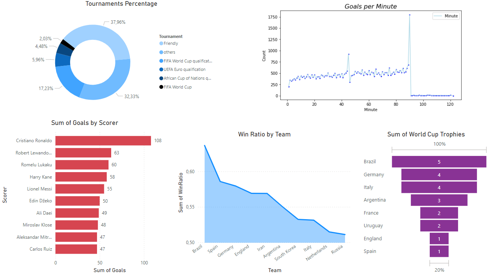
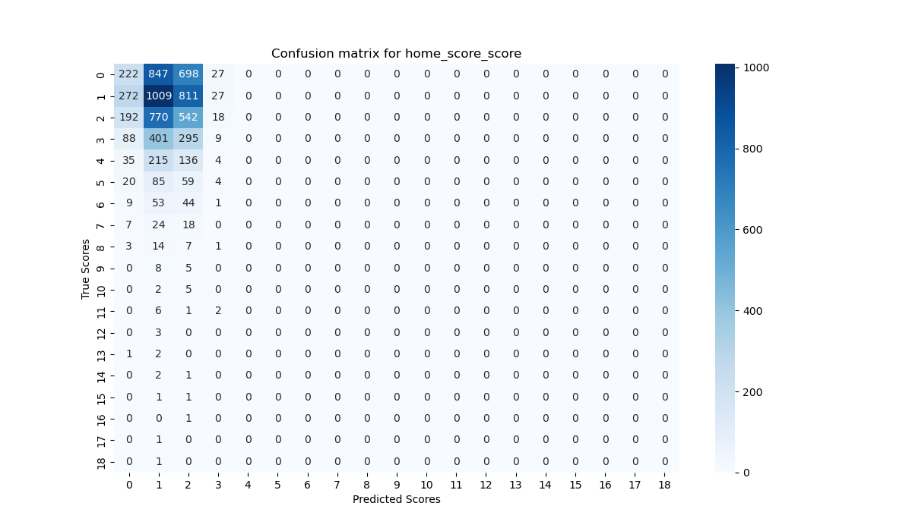

# Football Analytics and Data Engineering

## What Is This Project About?
This project focuses on data engineering using PySpark to process and analyze football data. It implements a comprehensive data processing and analytics pipeline, covering all stages from data extraction to predictive modeling and visualization. The key components of the project include:

### 1. ETL (Extract, Transform, Load) Pipeline
* Data Extraction: Connects to various data sources to extract raw football match data.
* Data Transformation: Preprocesses and cleans the data, performing operations like data type conversion, aggregation, and feature engineering to prepare it for further analysis.
* Data Loading: Loads the transformed data into a ***Data Warehouse*** or database

### 2. Data Visualization
* Generates insightful visualizations such as bar charts, pie charts, and line plots to analyze football statistics, including win ratios, top scorers, and tournament performance.

### 3. SQL Queries
* Implements SQL queries to extract, aggregate, and analyze key football metrics. This allows for deeper insights into statistics.

### 4. Predictive Modeling
* Prepares the data for machine learning models, performing feature engineering and transformation steps to build predictive models, such as forecasting match outcomes.

### 5. Insights and Reporting
* The project generates visualizations that can help understand key patterns and make data-driven decisions. Reports generated from Power BI facilitate a deeper understanding of the data.

## What Tools Are Used In The Project?
* Apache Spark: Used for distributed data processing and ***ETL*** (Extract, Transform, Load) operations
* PostgreSQL: Serves as the relational database for storing, querying, and managing both raw and transformed football data
* Power BI: Utilized for advanced data visualization and reporting.
* Docker: Facilitates containerization to run PostgreSQL and Jupyter-Pyspark-Notebook in isolated environments
* Python Libraries: 'pyspark', 'numpy', 'scikit-learn', 'tensorflow', 'matplotlib', 'seaborn'

## Data Explanation
This dataset includes results of international football matches starting from the very first official match in 1872 up to 2024. The matches range from FIFA World Cup to FIFI Wild Cup to regular friendly matches. The matches are strictly men's full internationals. You can browse this dataset [here](https://www.kaggle.com/datasets/martj42/international-football-results-from-1872-to-2017).

## Pipelines
This project offers different pipelines depending on our needs. We can split it into few important parts: 

### 1. ETL-Visualization 
The first step is the ***ETL*** pipeline, which extracts data from various sources and prepares it using SQL queries. Once the data is cleaned, the pipeline loads it into a ***Data Warehouse***. After the ***ETL*** process is complete, the transformed data is visualized using different graphs and dashboards in Power BI.



### 2. Modeling
Predicting football match scores is treated as a regression problem. To achieve this, a multi-input, multi-output and multi-class model has been designed. This pipeline includes the ***ETL*** process, with the main tasks being data extraction, feature engineering and data loading. After this process, the model can be created. Following model training, the model is evaluated and visualized.


###### INFO: Due to weaknesses in feature importance and insufficient number of features, the model's predictions have low accuracy.  

## Requirements
* Docker Desktop
* Power BI Desktop

## Prepare Steps
All you need is copy this repository and build docker image:
```bash
git clone https://github.com/WiktorPodwin/DataProcessing.git
cd SparkFootball
docker-compose up -d
```

## How To Launch It?
First, ensure that Docker Desktop is running. Then, you need to start the PostgreSQL and Jupyter-Notebook-PySpark containers.

In your browser, navigate to http://localhost:8888. You will need a token for authentication, which you can find in the Jupyter-Notebook-PySpark logs.

To run the ***Visualization Pipeline***, locate the relevant file in the visualization directory and click the ***Run*** button.

To run the ***Regression Pipeline***, find the corresponding file in the model directory and click the ***Run*** button as before.
